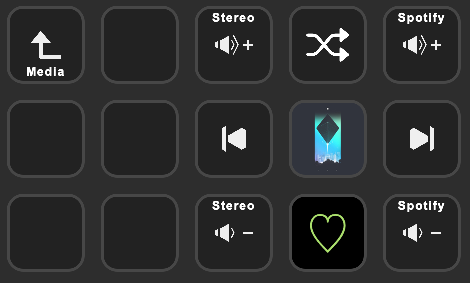
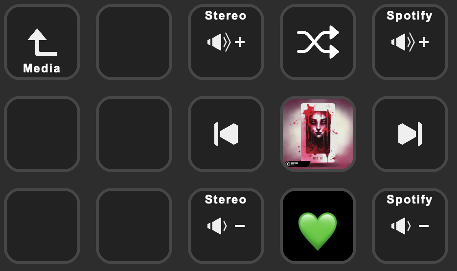

# spotify-liked

Checks if the current song is liked or not because it can't be read via AppleScript.
It simply outputs a `false` or `true`.

**NOTE**: It will open an auth link in your browser on first run or when its
token expires but after you authorize it the first time, the window should close
immediately after.

I use this in BetterTouchTool to make a Stream Deck button that shows whether
the current song is liked or not.

## Unliked song

## Liked song

Set SPOTIFY_ID and SPOTIFY_SECRET in `.env`, you'll get those values when you
set up an appplication on the [Spotify Developer portal](https://developer.spotify.com/dashboard).

If you haven't already, you'll need to install the BetterTouchTool plugin by
going to `Settings -> Stream Deck -> Install/Reinstall Stream Deck Plugin`.
The config for BetterTouchTool is in `BetterTouchTool trigger.json`, you will
need to update these in the `Script` part:

- `repo` to where this repo is cloned
- `go` to where your `go` is (recommend 1.19.5)

Then just add a
BetterTouchTool button to your Stream Deck with the ID `Liked`.
